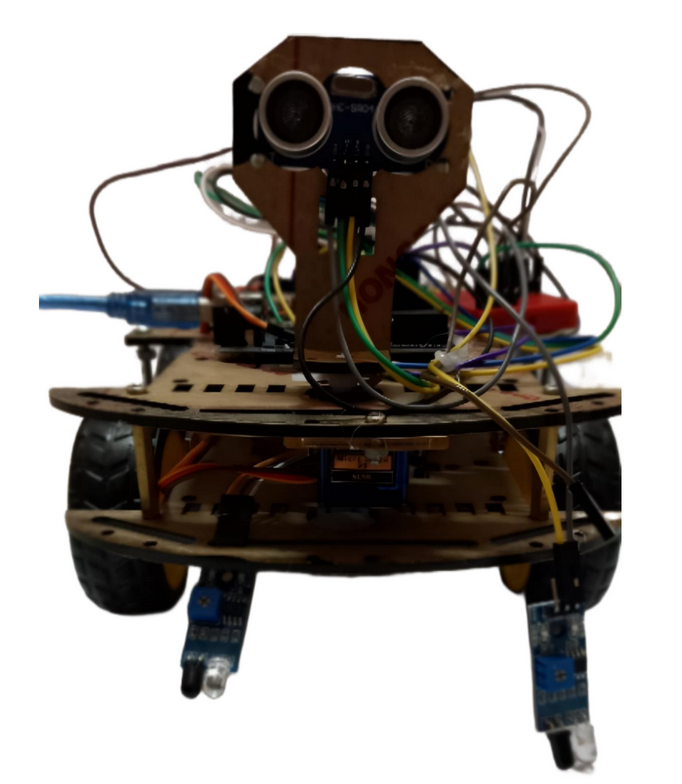
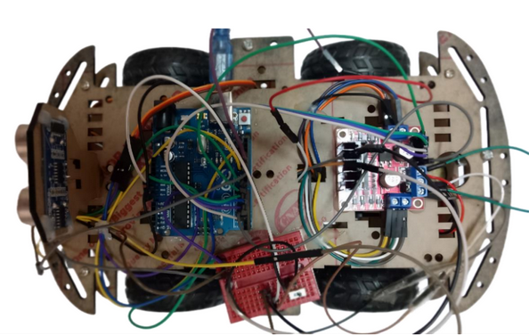
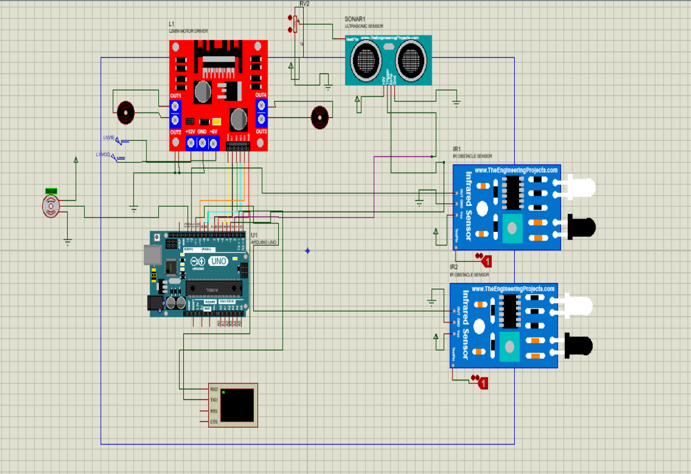

# ROBOT SUIVEUR DE LIGNE

Réaliser un robot suiveur de ligne : le robot devra suivre
une linge noire sur fond blanc . la détection de la ligne sera
assurée par des capteurs infrarouges sous sa base, mais le
robot aura aussi un capteur de distance devant
(ultrason) Pour éviter les obstacles . il sera piloté à l’aide
d’une carte Arduino UNO . le programme se fera sur arduino

---
## Screenshots

Below are some screenshots showcasing the project:

### Image 1

### Image 2

### Image 3

---